## Introduction
This project explores my facebook friend network. I hope this report provides a guide for anyone also interested in carrying out their own friend network analysis. Furthermore, I carried out an analysis between a few anomalyzed ego networks from stanford's database. 

## Obtaining Data
### Documentation
My personal facebook ego network data is obtained through the [Getnet](http://snacourse.com/getnet/?code=AQCIKpB2S0cmHie-fp2DgMK0I-WjziwLMG50WC8jEkqU56gNk5h4RlvFWz2RKRm0-dHvYK0ixVf86oomggtWkoGIF3yKRtkn5UGMZ3ZSqaSMZYhcAmV5TkubcYYEIoOUbKbCtJkHK82cph9KOHz-GaL6E99J3FY2oxuF6ifK1b_mnAhcFOwNEF8A77XdeYcZWdoUWLVUNzezrXHuCwSj1IJ6mNb36nRUQlX4dbV-7h6gHkeFr5wEoQaHKFl9rdVNA-o7RB3ZAfpT1fACT4WEviFQ3H26mwAgc-lSqHB-2rvCVxykLRPi9EU-yC53VIw0G2o&state=097fd3530d754add30b79bab5331e3e6#_=_) app with instructions posted in [assignment 1](https://class.coursera.org/sna-004/assignment/view?assignment_id=2) of a SNA class. The data is downloaded in .gml format. 

- [Project Repository](https://github.com/kenlau177/STAT545_Facebook_Network_Analysis)
- [personal ego network in .gml](https://raw.githubusercontent.com/kenlau177/STAT545_Facebook_Network_Analysis/master/facebook_with_relation.gml)
- [stanford ego networks in .gml](https://github.com/kenlau177/STAT545_Facebook_Network_Analysis/tree/master/facebook_stanford)

The other anomalyzed data sets were obtained from [Stanford's](http://snap.stanford.edu/data/egonets-Facebook.html) collection of social network data. There are 9 anomalyzed ego network data in total [@stanford_ego]. I compared the properties of the anomalyzed networks with my personal network.

### Explanation of Criteria for Including Nodes and Edges
The nodes in the networks represent friends. The edges represent the mutual friend relationships for each node. I kept all the nodes and edges for each network.

### Subjective interestingness/originality of the subject of data collection
In addition to the raw data from my facebook ego network, I've manually inserted "test" labels based on my relationship with each friend in my network. Part of the goal of this project is to see whether different community detection algorithms could pick up the correct clusters corresponding to my relationship with that person. These relations consist of competitive ultimate frisbee, recreational ultimate frisbee, work at environment canada, ubc computer science classmate, ubc statistics classmate, work at toys-r-us, high school, recreational hockey, recreational soccer, event at ubc, closest friends, or relative.

In addition, the idea of including additional ego network data came from Dr. Lada Adamic's reply in this [thread](https://class.coursera.org/sna-004/forum/thread?thread_id=357). Therefore, the ensemble of ego network is usually of interest.

## Data Analysis

### Stats on Personal Network
The following step-by-step code makes use of some [helper functions](https://github.com/kenlau177/Coursera_SNA_FB/blob/master/computeStats.R) created to generate statistics. It is not included here to minimize visual clutter. 

**Load in the following packages and helper functions**
```{r, message=F}
library(igraph)
library(RColorBrewer)
library(plyr)
library(dplyr)
library(xtable)
library(gridExtra)

source("count.degree.distribution.R")
source("computeStats.R")
```

**Read in the Graph**
```{r}
fbNetworkFile = "facebook_with_relation.gml"
G = read.graph(file=fbNetworkFile, format="gml")
```

**The "test labels" I mentioned earlier are called relations, that is, my relationship with a friend. Assign a colour to each relation.**
```{r}
pairedColors = c(brewer.pal(n=12, name="Paired"))
names(pairedColors) = c("ultimate-rec", "ultimate-competitive", "ubc-cpsc", 
                        "ubc-stat", "ubc-event", "closest-friends", "soccer", 
                        "hockey", "toys-r-us", "environment-canada", 
                        "high-school", "relative")
V(G)$color = revalue(V(G)$relation, pairedColors)
```

#### Graph Statistics
**Compute some graph statistics on personal network**
```{r}
outGraphStats = computeGraphStats(G)
```
**Average shortest path:**
This is the average number of steps along the shortest paths for all possible pairs of network nodes.

**Cluster coefficient:**
Degree to which nodes in a graph tend to cluster together. 

**Local Cluster coefficient:**
The fraction pairs of neighbours of the node that are themselves connected. This is the local cluster coefficient of myself. 

- Average shortest path: `r outGraphStats$avgShortestPath`
- Cluster coefficient: `r outGraphStats$transitivity`
- Local cluster coefficient: `r outGraphStats$localClusterCoefG`

**Let's compare this with an erdos-renyi random graph to see how it compares with my ego network**

**First simulate an erdos-renyi random graph with the same number of nodes and edges**
```{r}
erdo = erdos.renyi.game(length(V(G)), p.or.m=length(E(G)), type="gnm")
```

**Compute some graph statistics on erdos-renyi graph**
```{r}
gsErdo = computeGraphStats(erdo)
```
- Average shortest path: `r gsErdo$avgShortestPath`
- Cluster coefficient: `r gsErdo$transitivity`
- Local cluster coefficient: `r gsErdo$localClusterCoefG`

**Interpretation**

Both the average shortest path and cluster coefficient for the ego network is  higher than the random graph which is interesting. The ego network has several dense clusters and many cliques within clusters. The fact that there are a few cliques with little connections in the ego network may have contributed to the higher average shortest paths. 

#### Individual Statistics
Here, we compute individual statistics about the nodes in the graphs. I'll only only be computing these for a few people from every relation (or "test" labels). 

**Degree:**
The number of mutual friends.

**Betweeness:**
The number of shortest paths from all the nodes to all others that pass through that node.

**Closeness:**
The length of the average shortest path between a node and all other nodes in the network.

**Pick some names to analyze**
```{r}
nameList = c("Yuji Aizawa", "Jasper Lu", "Rhona Yue", "Kevin Underhill",
          "Esther Fann", "Sean Montgomery", "Tyki Sueyoshi", "Louisa Lau",
          "Ellery Lee", "Jonathan Baik", "Alex Tan", "Andrew Brear",
          "Angela S", "Simon Tai")
```

**Compute individual statistics**
```{r}
nodeStats = computeNodeStats(G)
nodeStats = cbind("name"=V(G)$label, "relation"=V(G)$relation, nodeStats)
nodeStats = data.frame(nodeStats)
nodeStats = nodeStats %>% filter(name %in% nameList) %>% 
              arrange(desc(betweenness))
```
```{r, results='asis'}
print(xtable(nodeStats), comment=F, type="html", include.rownames=F)
```


**Interpretation**

The table is ordered by highest betweenness. Yuji Aizawa is one of my closest friends. It appears that he has both the highest number of mutual friends and betweenness. This table also shows that a high number of degree does not imply that betweenness is high, for example, Kevin Underhill. Moreover, my closer friends generally have the highest betweeness.

#### Visualizations
**First filter out the labels to show only the names of interest**
```{r}
V(G)$label.cex = 1
labelsG = V(G)$label
labelsG[!(labelsG %in% nameList)] = NA
```
**The layout below is a good default layout for large graphs. [Here](http://stackoverflow.com/questions/5968612/how-do-i-lengthen-edges-in-an-igraph-network-plot-layout-fruchterman-reingold) is where I found it. In addition, the betweenness property is encoded by node size. Whereas, the relation is encoded with colour.**


<br></br>

**Interpretation**

The (force-directed?) layout algorithm  did a fairly good job at placing the nodes on the graph in respect to the true relation labels. That is to say, we can clearly discriminate the different groups. Of course, there may have been a small bias while manually labelling the points, for example, if a friend of mine worked at environment canada and also played ultimate frisbee. However, most reflect my relationship with the person. What stood out to me was, Simon Tai appeared to be clustered with my friends whom play ultimate frisbee. However, my relationship with him is through the stats department at ubc. It turns out he also plays ultimate frisbee recreationally and we have a lot of friends in common that play ultimate frisbee.

<br></br>

Now let's take a look at what the erdos-renyi random graph look like.

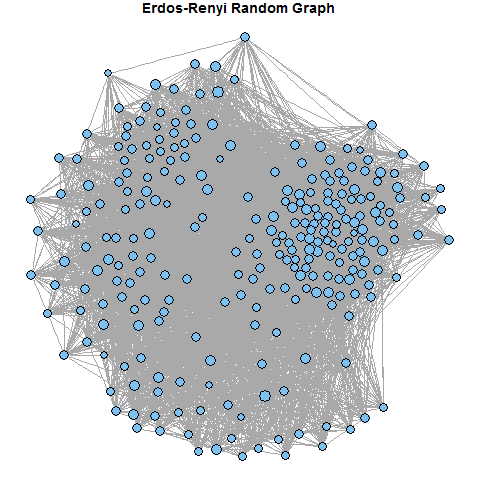

##### Community Detection
We carried out 2 different community detection algorithms: modularity and walk-trap. Modularity algorithm considers edges that fall within a community or between a community and the rest of the network. Walk-trap algorithm finds communities through random walks. The idea behind walk-trap is that short random walks tend to stay in the same community. (Walk-trap will count towards having tried out a method not introduced in class)

**Execute community finding algorithms for personal network and erdos-renyi graphs**
```{r}
mc = fastgreedy.community(G)
mcErdo = fastgreedy.community(erdo)

wtc = walktrap.community(G, steps=4)
wtcErdo = walktrap.community(erdo, steps=4)
```

Plotting details are omitted here, but the code can be found in [plotCommunites.R](https://github.com/kenlau177/Coursera_SNA_FB/blob/master/plotCommunities.R)

**Modularity score community finding algorithm**
<table class='container'>
<td>
<p>My Ego Network</p>
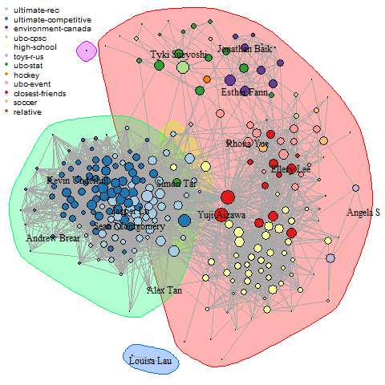
</td>
<td>
<p>Erdos-Renyi</p>
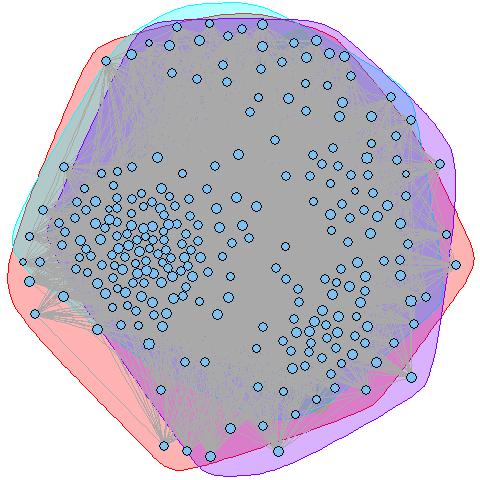
</td>
</table>

**Walk-trap community finding algorithm**
<table class='container'>
<td>
<p>My Ego Network</p>

</td>
<td>
<p>Erdos-Renyi</p>
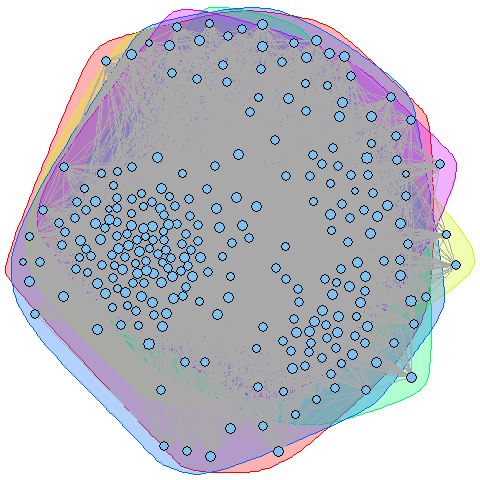
</td>
</table>

**Interpretation**

The erdos-renyi random graph does not exhibit any interesting communities after performing the modularity and walk-trap algorithms. However, the ego network definitely has some interesting communities. In particular the walk-trap algorithm detected the cluster involving friends who play ultimate. Moreover, it grouped together my closest friends with the people who I met at a ubc event. It found the group of people I worked at toys-r-us. It trivially detected my relatives, since they have no connections with any other person in the graph.

### Stats Including Stanford Anomalyzed Ego Networks

#### Graph Stats
```{r}
# compute graph statistics similarly as for my ego network
getGraphStatsEgoS = function(egoStanfordFile){
  egoS = read.graph(egoStanfordFile, directed=F)
  egoS = simplify(egoS, remove.multiple=T, remove.loops=T)
  egoSstr = sub("\\.edges", "", basename(egoStanfordFile))
  out = data.frame("network"=paste0("stanford-ego_",egoSstr), 
          as.data.frame(computeGraphStats(egoS)))
  return(out)
}
# find stanford anomalyzed ego networks
egoStanfordFiles = list.files("facebook_stanford", "edges", full.names=T)
graphStatsDf = ldply(egoStanfordFiles, .fun=getGraphStatsEgoS)
# combine the graph stats information in a dataframe
temp = rbind(as.data.frame(c("network"="my-ego_network", outGraphStats)), 
        as.data.frame(c("network"="erdo_network", gsErdo)))
graphStatsDf = rbind(temp, graphStatsDf)
graphStatsDf = graphStatsDf %>% arrange(desc(transitivity))
```
```{r, results="asis", echo=F}
print(xtable(graphStatsDf), comment=F, type="html", include.rownames=F)
```
<br></br>

**Interpretation**

The table was arranged with respect to transitivity, also known as clustering coefficient. It turns out that my ego network is third highest in terms of transivity. All the ego networks had much higher transitivity levels than the erdos-renyi random graph. Similary, the average shortest path is also all greater than the random graph. In terms of average shortest path and transitivity, my ego network fit right in with the stanford samples.

#### Community Comparisons and Visualizations
Community structure finding is carried out on the 9 sample ego network from the stanford database. We used both the modularity score and walk-trap algorithm. The figures are shown below.

**Modularity score community finding algorithm**
<table class='container'>
<td>
<p>My Ego Network</p>

</td>
<td>
<p>Sample Network</p>
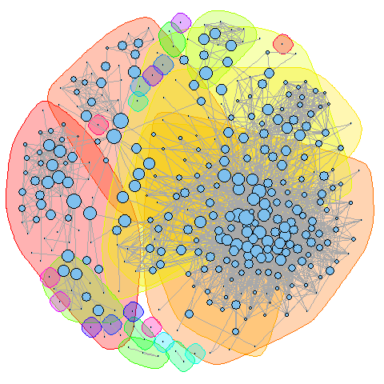
</td>
<td>
<p>Sample Network</p>
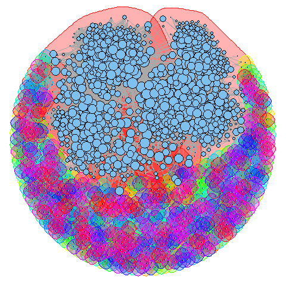
</td>
<td>
<p>Sample Network</p>

</td>
</table>

<table class='container'>
<td>
<p>Sample Network</p>
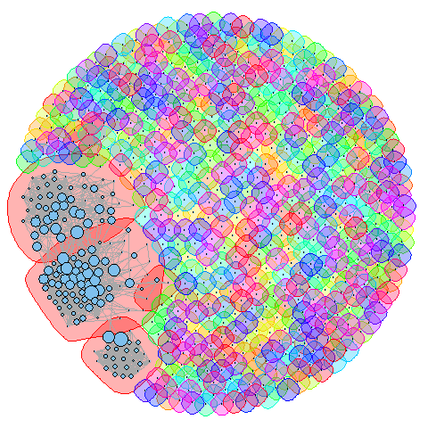
</td>
<td>
<p>Sample Network</p>
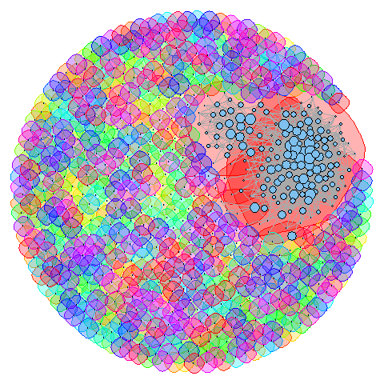
</td>
<td>
<p>Sample Network</p>
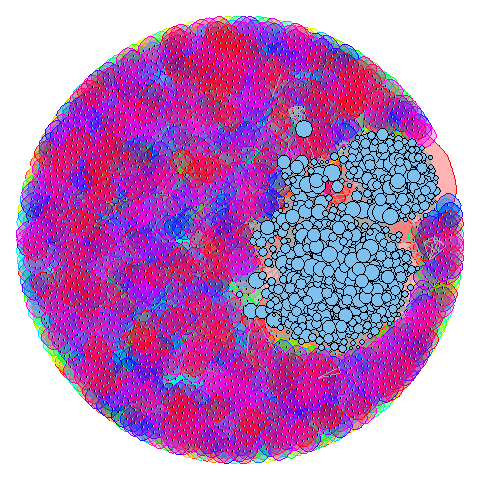
</td>
<td>
<p>Sample Network</p>
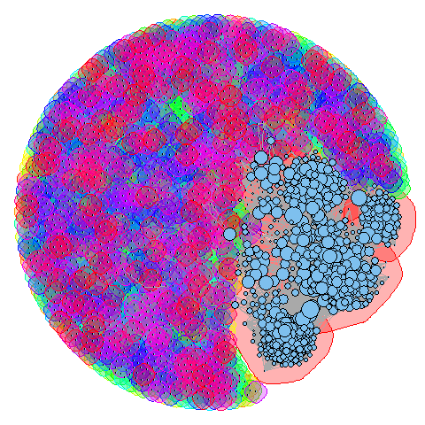
</td>
</table>

<table class='container'>
<td>
<p>Sample Network</p>
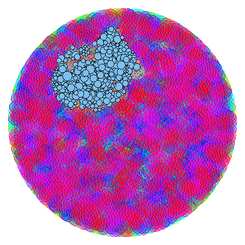
</td>
<td>
<p>Sample Network</p>

</td>
<td>
<p>Erdo-Renyi</p>

</td>
<td>

</td>
</table>

<br></br>
<br></br>

**Walk-trap community finding algorithm**
<table class='container'>
<td>
<p>My Ego Network</p>

</td>
<td>
<p>Sample Network</p>
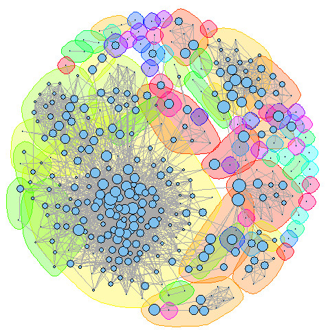
</td>
<td>
<p>Sample Network</p>
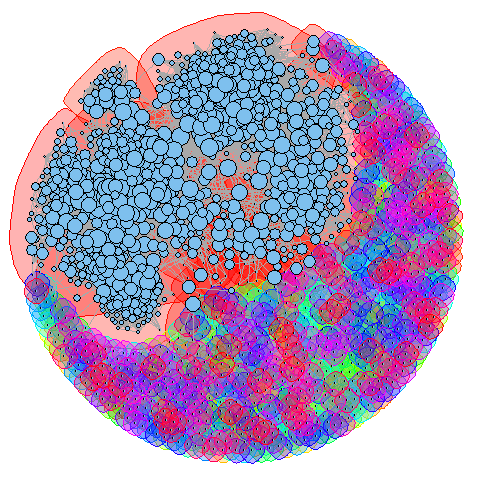
</td>
<td>
<p>Sample Network</p>
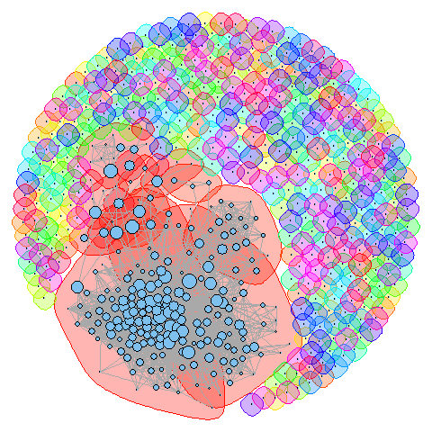
</td>
</table>

<table class='container'>
<td>
<p>Sample Network</p>
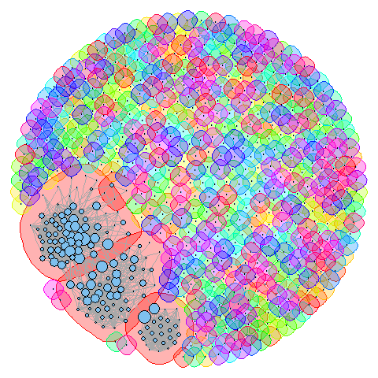
</td>
<td>
<p>Sample Network</p>
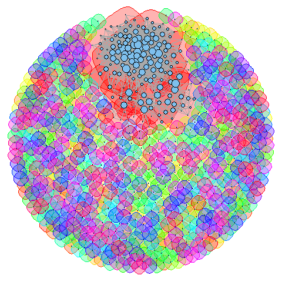
</td>
<td>
<p>Sample Network</p>
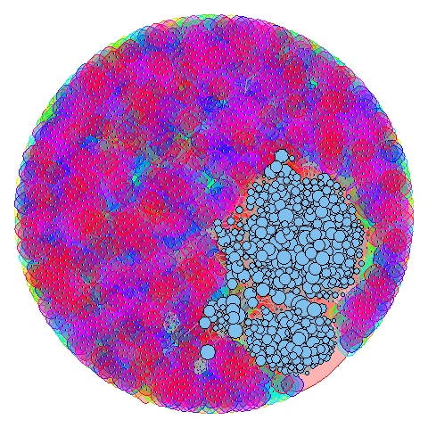
</td>
<td>
<p>Sample Network</p>
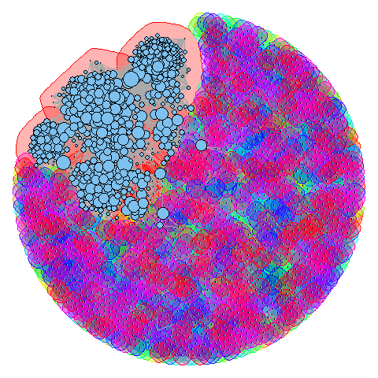
</td>
</table>

<table class='container'>
<td>
<p>Sample Network</p>
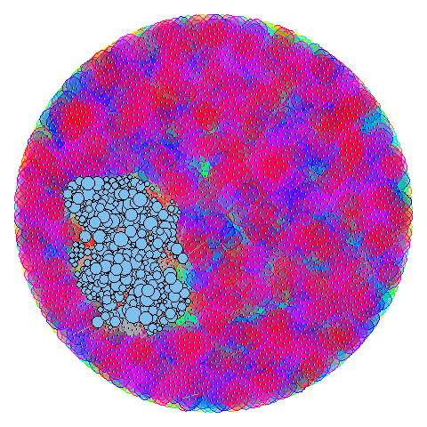
</td>
<td>
<p>Sample Network</p>
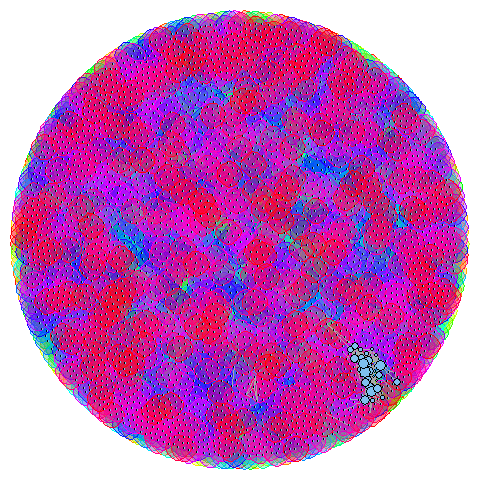
</td>
<td>
<p>Erdo-Renyi</p>

</td>
<td>

</td>
</table>

<br></br>

**Interpretation**

The number of communities detected varies between the sample ego networks. The second network from the top left has the most similar community structure as my ego network. However, there are a lot of communities amongst the other networks. The third network from the top appears to have several giant componenents and many external small cliques suggesting that there is a large group of friends with many connections as well as many small groups of friends.

## References


