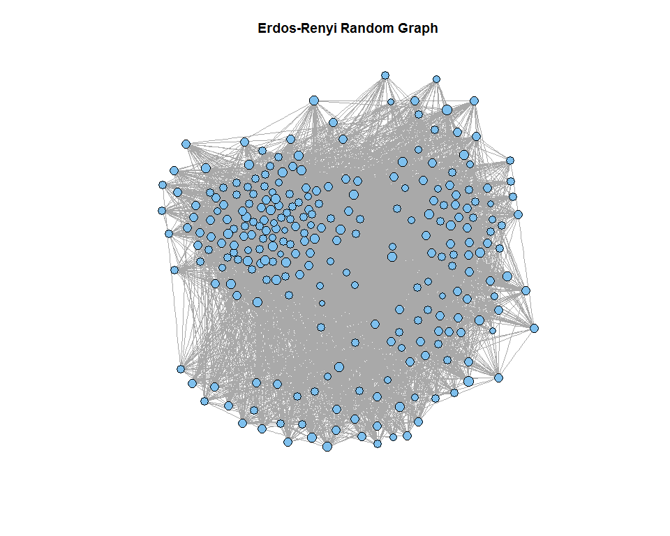

# Coursera SNA Peer-Eval Project
Ken Lau  
Sunday, November 23, 2014  

## Introduction
This project is an extension of the analysis of my facebook ego network as worked on in class. In addition to the in-depth analysis of the personal network, I also carried out an analysis between a few anomalyzed ego networks.

## Obtaining Data
### Documentation
My personal facebook ego network data is obtained through the [Getnet](http://snacourse.com/getnet/?code=AQCIKpB2S0cmHie-fp2DgMK0I-WjziwLMG50WC8jEkqU56gNk5h4RlvFWz2RKRm0-dHvYK0ixVf86oomggtWkoGIF3yKRtkn5UGMZ3ZSqaSMZYhcAmV5TkubcYYEIoOUbKbCtJkHK82cph9KOHz-GaL6E99J3FY2oxuF6ifK1b_mnAhcFOwNEF8A77XdeYcZWdoUWLVUNzezrXHuCwSj1IJ6mNb36nRUQlX4dbV-7h6gHkeFr5wEoQaHKFl9rdVNA-o7RB3ZAfpT1fACT4WEviFQ3H26mwAgc-lSqHB-2rvCVxykLRPi9EU-yC53VIw0G2o&state=097fd3530d754add30b79bab5331e3e6#_=_) app with instructions posted in [assignment 1](https://class.coursera.org/sna-004/assignment/view?assignment_id=2) of the SNA class. The data is downloaded in .gml format. 

- [Project Repository](https://github.com/kenlau177/Coursera_SNA_FB)
- [personal ego network in .gml](https://raw.githubusercontent.com/kenlau177/Coursera_SNA_FB/master/facebook_with_relation.gml)
- [stanford ego networks in .gml](https://github.com/kenlau177/Coursera_SNA_FB/tree/master/facebook_stanford)

The other anomalyzed data sets were obtained from [Stanford's](http://snap.stanford.edu/data/egonets-Facebook.html) collection of social network data. There are 10 anomalyzed ego network data in total. We make use of these by comparing the properties with my personal network [@stanford_ego].

### Explanation of Criteria for Including Nodes and Edges
The nodes represent the friends from the corresponding individual's facebook ego network data. The edges represent the mutual friend relationships. I believe there may have been some munging/filtering of data in the stanford ego networks.

### Subjective interestingness/originality of the subject of data collection
In addition to the raw data from my facebook ego network, I've manually inserted "test" labels of how I met each individual friend in my network. Part of the goal of this project is to see whether different community detection algorithms could pick up the correct clusters corresponding to how I've met them in person. For example, from playing Ultimate Frisbee, high school, UBC stats department, etc.

In addition, the idea of including additional ego network data came from Dr. Lada Adamic's reply in this [thread](https://class.coursera.org/sna-004/forum/thread?thread_id=357). Therefore, the ensemble of ego network is usually of interest also.

## Data Analysis

### Stats on Personal Network
The following step-by-step code makes use of some [helper functions](https://github.com/kenlau177/Coursera_SNA_FB/blob/master/computeStats.R) created to generate statistics. It is not included here to minimize visual clutter. 

**Load in the following packages and helper functions**

```r
library(igraph)
library(RColorBrewer)
library(plyr)
library(dplyr)
library(xtable)
library(gridExtra)

source("count.degree.distribution.R")
source("computeStats.R")
```

**Read in the Graph**

```r
fbNetworkFile = "facebook_with_relation.gml"
G = read.graph(file=fbNetworkFile, format="gml")
```

**The "test labels" I mentioned earlier are called relations, that is, how I first met a particular friend. Assign a colour to each relation.**

```r
pairedColors = c(brewer.pal(n=12, name="Paired"))
names(pairedColors) = c("ultimate-rec", "ultimate-competitive", "ubc-cpsc", 
                        "ubc-stat", "ubc-event", "closest-friends", "soccer", 
                        "hockey", "toys-r-us", "environment-canada", 
                        "high-school", "relative")
V(G)$color = revalue(V(G)$relation, pairedColors)
```

#### Graph Statistics
**Compute some graph statistics on personal network**

```r
outGraphStats = computeGraphStats(G)
```
**Average shortest path:**
This is the average number of steps along the shortest paths for all possible pairs of network nodes.

**Cluster coefficient:**
Degree to which nodes in a graph tend to cluster together. 

**Local Cluster coefficient:**
The fraction pairs of neighbours of the node that are themselves connected. This is the local cluster coefficient for myself. 

- Average shortest path: 2.3542873
- Cluster coefficient: 0.5481617
- Local cluster coefficient: 0.1321006

**Let's compare this with a erdos-renyi random graph to see how it compares with my ego network**

**First simulate an erdos-renyi random graph is same number of nodes and edges**

```r
erdo = erdos.renyi.game(length(V(G)), p.or.m=length(E(G)), type="gnm")
```

**Compute some graph statistics on erdos-renyi graph**

```r
gsErdo = computeGraphStats(erdo)
```
- Average shortest path: 1.8768043
- Cluster coefficient: 0.1331016
- Local cluster coefficient: 0.1321006

**Interpretation**
Both the average shortest path and cluster coefficient for the ego network is both higher than the random graph which is interesting. The ego network has several dense clusters, and many cliques within clusters as we shall see later. Therefore, the cluster coefficient is high. Since, there are nodes with very few links may have contributed to the higher average shortest path.

#### Individual Statistics
Here, we compute individual statistics about the nodes in the graphs. I'll only only be computing these for a few people from every relation (or "test" labels). 

**Degree:**
The number of mutual friends.

**Betweeness:**
The number of shortest paths from all the nodes to all others that pass through that node.

**Closeness:**
The length of the average shortest path between a node and all other nodes in the network.

**Pick some names to analyze**

```r
nameList = c("Yuji Aizawa", "Jasper Lu", "Rhona Yue", "Kevin Underhill",
          "Esther Fann", "Sean Montgomery", "Tyki Sueyoshi", "Louisa Lau",
          "Ellery Lee", "Jonathan Baik", "Alex Tan", "Andrew Brear",
          "Angela S", "Simon Tai")
```

**Compute individual statistics**

```r
nodeStats = computeNodeStats(G)
nodeStats = cbind("name"=V(G)$label, "relation"=V(G)$relation, nodeStats)
nodeStats = data.frame(nodeStats)
nodeStats = nodeStats %>% filter(name %in% nameList) %>% 
              arrange(desc(betweenness))
```

```r
print(xtable(nodeStats), comment=F, type="html", include.rownames=F)
```

<table border=1>
<tr> <th> name </th> <th> relation </th> <th> degree </th> <th> betweenness </th> <th> closeness </th>  </tr>
  <tr> <td> Yuji Aizawa </td> <td> closest-friends </td> <td align="right"> 107.00 </td> <td align="right"> 4702.97 </td> <td align="right"> 0.00 </td> </tr>
  <tr> <td> Jasper Lu </td> <td> ultimate-rec </td> <td align="right"> 88.00 </td> <td align="right"> 1040.79 </td> <td align="right"> 0.00 </td> </tr>
  <tr> <td> Ellery Lee </td> <td> closest-friends </td> <td align="right"> 27.00 </td> <td align="right"> 508.51 </td> <td align="right"> 0.00 </td> </tr>
  <tr> <td> Rhona Yue </td> <td> ubc-event </td> <td align="right"> 20.00 </td> <td align="right"> 405.73 </td> <td align="right"> 0.00 </td> </tr>
  <tr> <td> Esther Fann </td> <td> environment-canada </td> <td align="right"> 13.00 </td> <td align="right"> 389.40 </td> <td align="right"> 0.00 </td> </tr>
  <tr> <td> Tyki Sueyoshi </td> <td> ubc-stat </td> <td align="right"> 8.00 </td> <td align="right"> 240.74 </td> <td align="right"> 0.00 </td> </tr>
  <tr> <td> Simon Tai </td> <td> ubc-stat </td> <td align="right"> 37.00 </td> <td align="right"> 204.92 </td> <td align="right"> 0.00 </td> </tr>
  <tr> <td> Sean Montgomery </td> <td> ultimate-competitive </td> <td align="right"> 67.00 </td> <td align="right"> 150.26 </td> <td align="right"> 0.00 </td> </tr>
  <tr> <td> Jonathan Baik </td> <td> environment-canada </td> <td align="right"> 9.00 </td> <td align="right"> 101.45 </td> <td align="right"> 0.00 </td> </tr>
  <tr> <td> Kevin Underhill </td> <td> ultimate-competitive </td> <td align="right"> 56.00 </td> <td align="right"> 63.87 </td> <td align="right"> 0.00 </td> </tr>
  <tr> <td> Andrew Brear </td> <td> ultimate-competitive </td> <td align="right"> 28.00 </td> <td align="right"> 16.73 </td> <td align="right"> 0.00 </td> </tr>
  <tr> <td> Alex Tan </td> <td> ubc-cpsc </td> <td align="right"> 4.00 </td> <td align="right"> 0.05 </td> <td align="right"> 0.00 </td> </tr>
  <tr> <td> Angela S </td> <td> toys-r-us </td> <td align="right"> 2.00 </td> <td align="right"> 0.00 </td> <td align="right"> 0.00 </td> </tr>
  <tr> <td> Louisa Lau </td> <td> relative </td> <td align="right"> 2.00 </td> <td align="right"> 0.00 </td> <td align="right"> 0.00 </td> </tr>
   </table>

<br></br>
**Interpretation**

The table is ordered by highest betweenness. Yuji Aizawa is one of my closest friends. It appears that he has both the highest number of mutual friends and betweenness. This table also shows that a high number of degree does not imply that betweenness is high. Moreover, my closer friends have generally high betweeness.

#### Visualizations
**First filter out the labels to show only the names of interest**

```r
V(G)$label.cex = 1
labelsG = V(G)$label
labelsG[!(labelsG %in% nameList)] = NA
```
**The layout below is a great default layout for large graphs. [Here](http://stackoverflow.com/questions/5968612/how-do-i-lengthen-edges-in-an-igraph-network-plot-layout-fruchterman-reingold) is where I found it. In addition, the betweenness property is encoded by node size. Whereas, the relation is encoded with colour.

```r
opar <- par()$mar; par(mar=rep(0, 4))
layout <- layout.fruchterman.reingold(G, niter=500, area=vcount(G)^2.3, 
            repulserad=vcount(G)^2.8)
myPlot = plot(G, layout=layout, vertex.size=log(betweenness(G) + 1), 
          vertex.label=labelsG, vertex.label.color="black")
legendLabels = unique(V(G)$relation)
legendColours = unique(V(G)$color)
legend("topleft", legend=legendLabels, col=legendColours, pch=19, 
  bty="n", cex=.8)
```


<br></br>
**Interpretation**

The algorithm layout (force-directed type?) algorithm  did a fairly good job at placing the nodes on the graph in respect to the true relation labels. That is to say, we can clearly discriminate the different groups. Of course, there may have been a small bias while manually labelling the points. However, most relation reflect my first encounter with the person, so the bias is minimized in that respect. What stood out to me was, Simon Tai appears to be clustered with my friends whom play ultimate frisbee. However, I know him because of my relation with him within the stats department at ubc. It turns out he plays ultimate frisbee recreationally and has a lot of friends in common that also plays ultimate. 

<br></br>
Now let's take a look at what the erdos-renyi random graph look like.

```r
labelsG = NA
erdos = erdos.renyi.game(length(V(G)), p.or.m=length(E(G)), type="gnm")
erdosPlot = plot(erdos, layout=layout, vertex.size=log(betweenness(erdos)+1), 
              vertex.label=labelsG)
title("Erdos-Renyi Random Graph")
```


## References


